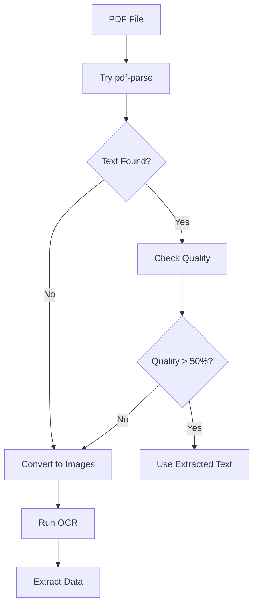

# OCR Implementation Guide for PDF Processing

## 🎯 When You Need OCR

About 15% of PDFs are "image-based" or "scanned" PDFs where:
- Text extraction returns empty or garbage text
- The PDF is essentially photos of documents
- Text is embedded in images within the PDF

**Strategy:** Try regular text extraction first, fall back to OCR if needed.

## 🛠 OCR Tech Stack

### Required Packages
```bash
# Install OCR dependencies
npm install tesseract.js pdf-to-pic sharp

# For better PDF rendering (optional but recommended)
npm install canvas pdf2canvas
```

### Why These Libraries?
- **tesseract.js** - JavaScript port of Tesseract OCR (no system dependencies!)
- **pdf-to-pic** - Converts PDF pages to images
- **sharp** - Fast image processing (resize, optimize)

## 📋 Implementation Strategy



## 💻 Complete OCR Implementation

### 1. Enhanced PDF Extractor with OCR Fallback

```typescript
// src/main/services/pdfExtractorWithOCR.ts
import pdf from 'pdf-parse';
import { createWorker, Worker } from 'tesseract.js';
import { fromPath } from 'pdf2pic';
import fs from 'fs-extra';
import path from 'path';
import { app } from 'electron';

interface ExtractionResult {
  text: string;
  method: 'standard' | 'ocr';
  confidence: number;
  pageCount: number;
}

export async function extractVehicleDataWithOCR(
  pdfPath: string,
  onProgress?: (progress: number, message: string) => void
): Promise<ExtractedVehicleData> {
  
  // Step 1: Try standard extraction first
  onProgress?.(10, 'Attempting standard text extraction...');
  const standardResult = await tryStandardExtraction(pdfPath);
  
  // Step 2: Check if we got useful text
  if (standardResult && isTextUsable(standardResult.text)) {
    onProgress?.(90, 'Text extraction successful');
    return parseExtractedText(standardResult.text, 'standard');
  }
  
  // Step 3: Fall back to OCR
  onProgress?.(20, 'Standard extraction failed, starting OCR...');
  const ocrResult = await performOCR(pdfPath, onProgress);
  
  return parseExtractedText(ocrResult.text, 'ocr');
}

// Standard PDF text extraction
async function tryStandardExtraction(pdfPath: string): Promise<ExtractionResult | null> {
  try {
    const pdfBuffer = await fs.readFile(pdfPath);
    const data = await pdf(pdfBuffer);
    
    return {
      text: data.text,
      method: 'standard',
      confidence: 100,
      pageCount: data.numpages
    };
  } catch (error) {
    console.error('Standard extraction failed:', error);
    return null;
  }
}

// Check if extracted text is usable
function isTextUsable(text: string): boolean {
  if (!text || text.length < 100) return false;
  
  // Check for readable content (not just symbols/garbage)
  const readableChars = text.match(/[a-zA-Z0-9\s]/g);
  const readableRatio = readableChars ? readableChars.length / text.length : 0;
  
  // Check for key automotive terms
  const hasAutoTerms = /\b(vehicle|VIN|make|model|year|mileage|miles)\b/i.test(text);
  
  return readableRatio > 0.5 && hasAutoTerms;
}

// OCR Processing
async function performOCR(
  pdfPath: string,
  onProgress?: (progress: number, message: string) => void
): Promise<ExtractionResult> {
  
  const tempDir = path.join(app.getPath('temp'), 'ocr_temp', Date.now().toString());
  await fs.ensureDir(tempDir);
  
  let worker: Worker | null = null;
  
  try {
    // Step 1: Convert PDF to images
    onProgress?.(30, 'Converting PDF to images...');
    const imagePaths = await convertPDFToImages(pdfPath, tempDir);
    
    // Step 2: Initialize Tesseract worker
    onProgress?.(40, 'Initializing OCR engine...');
    worker = await createWorker({
      logger: (m) => {
        // Track OCR progress
        if (m.status === 'recognizing text' && m.progress) {
          const progress = 40 + (m.progress * 40); // 40-80% range
          onProgress?.(progress, `Processing page...`);
        }
      }
    });
    
    await worker.loadLanguage('eng');
    await worker.initialize('eng');
    
    // Step 3: Process each image
    const texts: string[] = [];
    for (let i = 0; i < imagePaths.length; i++) {
      onProgress?.(
        50 + (i / imagePaths.length) * 30,
        `Processing page ${i + 1} of ${imagePaths.length}...`
      );
      
      const { data } = await worker.recognize(imagePaths[i]);
      texts.push(data.text);
    }
    
    // Step 4: Combine results
    const fullText = texts.join('\n\n--- PAGE BREAK ---\n\n');
    
    return {
      text: fullText,
      method: 'ocr',
      confidence: calculateOCRConfidence(fullText),
      pageCount: imagePaths.length
    };
    
  } finally {
    // Cleanup
    if (worker) await worker.terminate();
    await fs.remove(tempDir).catch(console.error);
  }
}

// Convert PDF pages to images
async function convertPDFToImages(pdfPath: string, outputDir: string): Promise<string[]> {
  const options = {
    density: 200,           // DPI - higher = better quality but slower
    saveFilename: 'page',
    savePath: outputDir,
    format: 'png',
    width: 2000,           // Max width - maintains aspect ratio
    height: 2800           // Max height - maintains aspect ratio
  };
  
  const converter = fromPath(pdfPath, options);
  const result = await converter.bulk(-1, true); // -1 = all pages
  
  // Return sorted paths
  return result
    .map(page => page.path)
    .filter(p => p !== undefined)
    .sort((a, b) => {
      // Sort by page number
      const aNum = parseInt(a.match(/page\.(\d+)/)?.[1] || '0');
      const bNum = parseInt(b.match(/page\.(\d+)/)?.[1] || '0');
      return aNum - bNum;
    });
}

// Calculate confidence for OCR results
function calculateOCRConfidence(text: string): number {
  let confidence = 60; // Base confidence for OCR
  
  // Check for common OCR issues
  if (text.includes('�')) confidence -= 10;        // Unicode errors
  if (/[^\x00-\x7F]{5,}/.test(text)) confidence -= 10; // Non-ASCII sequences
  
  // Check for expected content
  if (/\b[A-HJ-NPR-Z0-9]{17}\b/.test(text)) confidence += 10; // VIN found
  if (/\d{1,3},?\d{3}\s*mi/i.test(text)) confidence += 10;    // Mileage found
  
  return Math.max(0, Math.min(100, confidence));
}
```

### 2. Optimized Image Processing for Better OCR

```typescript
// src/main/services/imageProcessor.ts
import sharp from 'sharp';
import path from 'path';

export async function preprocessImageForOCR(imagePath: string): Promise<string> {
  const outputPath = imagePath.replace('.png', '_processed.png');
  
  await sharp(imagePath)
    // Convert to grayscale
    .grayscale()
    // Increase contrast
    .normalize()
    // Sharpen text
    .sharpen()
    // Remove noise
    .median(1)
    // Ensure high contrast (black text on white)
    .threshold(128)
    // Save optimized image
    .toFile(outputPath);
  
  return outputPath;
}

// For poor quality scans, use this enhanced processing
export async function enhanceScannedDocument(imagePath: string): Promise<string> {
  const outputPath = imagePath.replace('.png', '_enhanced.png');
  
  await sharp(imagePath)
    .grayscale()
    // Adjust levels for better contrast
    .linear(1.5, -(0.5 * 255))
    // Remove shadows and background
    .threshold(140)
    // Denoise
    .blur(0.5)
    .sharpen()
    // Resize if too large (speeds up OCR)
    .resize(2000, null, {
      withoutEnlargement: true,
      fit: 'inside'
    })
    .toFile(outputPath);
  
  return outputPath;
}
```

### 3. Smart Fallback Logic

```typescript
// src/main/services/smartPDFProcessor.ts

export class SmartPDFProcessor {
  private standardExtractionCache = new Map<string, string>();
  
  async processWithSmartFallback(
    pdfPath: string,
    onProgress?: (progress: number, message: string) => void
  ): Promise<PDFProcessingResult> {
    const startTime = Date.now();
    
    try {
      // Quick check: Is this a text PDF or image PDF?
      const pdfType = await this.detectPDFType(pdfPath);
      onProgress?.(5, `Detected ${pdfType} PDF`);
      
      let extractedText: string;
      let method: 'standard' | 'ocr';
      
      if (pdfType === 'text' || pdfType === 'mixed') {
        // Try standard extraction first
        const result = await tryStandardExtraction(pdfPath);
        
        if (result && this.isQualityText(result.text)) {
          extractedText = result.text;
          method = 'standard';
          onProgress?.(90, 'Standard extraction successful');
        } else if (pdfType === 'mixed') {
          // Mixed PDF - extract text AND run OCR on images
          onProgress?.(20, 'Mixed content detected, using hybrid approach...');
          extractedText = await this.hybridExtraction(pdfPath, onProgress);
          method = 'ocr';
        } else {
          // Poor quality text, use OCR
          onProgress?.(20, 'Text quality poor, switching to OCR...');
          const ocrResult = await performOCR(pdfPath, onProgress);
          extractedText = ocrResult.text;
          method = 'ocr';
        }
      } else {
        // Pure image PDF - straight to OCR
        onProgress?.(10, 'Image-based PDF, using OCR...');
        const ocrResult = await performOCR(pdfPath, onProgress);
        extractedText = ocrResult.text;
        method = 'ocr';
      }
      
      // Parse the extracted text
      const vehicleData = this.parseVehicleData(extractedText);
      
      return {
        success: true,
        extractedData: vehicleData,
        extractionMethod: method,
        processingTime: Date.now() - startTime,
        errors: [],
        warnings: method === 'ocr' ? ['OCR was used - please verify data'] : []
      };
      
    } catch (error) {
      return {
        success: false,
        errors: [error.message],
        warnings: [],
        processingTime: Date.now() - startTime
      };
    }
  }
  
  // Detect if PDF contains text or just images
  private async detectPDFType(pdfPath: string): Promise<'text' | 'image' | 'mixed'> {
    const buffer = await fs.readFile(pdfPath);
    const data = await pdf(buffer);
    
    const textLength = data.text.trim().length;
    const pageCount = data.numpages;
    
    // Average chars per page
    const charsPerPage = textLength / pageCount;
    
    if (charsPerPage < 50) return 'image';
    if (charsPerPage > 500) return 'text';
    return 'mixed';
  }
  
  // Check if extracted text is high quality
  private isQualityText(text: string): boolean {
    // Must have minimum content
    if (text.length < 200) return false;
    
    // Check for required fields
    const hasVIN = /\b[A-HJ-NPR-Z0-9]{17}\b/.test(text);
    const hasYear = /\b(19|20)\d{2}\b/.test(text);
    const hasMileage = /\d{1,3},?\d{3}\s*(miles|mi\b)/i.test(text);
    
    // Need at least 2 out of 3 key fields
    const keyFieldsFound = [hasVIN, hasYear, hasMileage].filter(Boolean).length;
    
    return keyFieldsFound >= 2;
  }
  
  // Hybrid extraction for mixed PDFs
  private async hybridExtraction(
    pdfPath: string,
    onProgress?: (progress: number, message: string)
  ): Promise<string> {
    // Get text from standard extraction
    const standardResult = await tryStandardExtraction(pdfPath);
    const standardText = standardResult?.text || '';
    
    // Also run OCR to catch any embedded images
    const ocrResult = await performOCR(pdfPath, onProgress);
    
    // Combine and deduplicate
    return this.mergeExtractedText(standardText, ocrResult.text);
  }
  
  // Intelligently merge text from multiple sources
  private mergeExtractedText(text1: string, text2: string): string {
    // Simple approach: concatenate with separator
    // Advanced: Could use fuzzy matching to remove duplicates
    return `${text1}\n\n--- Additional OCR Content ---\n\n${text2}`;
  }
  
  private parseVehicleData(text: string): ExtractedVehicleData {
    // Your existing parsing logic here
    return parseExtractedText(text, 'standard');
  }
}
```

### 4. Integration with Main Process

```typescript
// src/main/index.ts - Updated IPC handler
import { SmartPDFProcessor } from './services/smartPDFProcessor';

const pdfProcessor = new SmartPDFProcessor();

ipcMain.handle('process-pdf-smart', async (event, pdfPath: string) => {
  // Send progress updates to renderer
  const onProgress = (progress: number, message: string) => {
    event.sender.send('pdf-progress', { progress, message });
  };
  
  return await pdfProcessor.processWithSmartFallback(pdfPath, onProgress);
});
```

### 5. Frontend Progress Display

```tsx
// src/renderer/components/PDFProcessor.tsx
import React, { useState, useEffect } from 'react';
import { Progress, Alert } from 'antd';

export function PDFProcessor() {
  const [processing, setProcessing] = useState(false);
  const [progress, setProgress] = useState(0);
  const [statusMessage, setStatusMessage] = useState('');
  const [ocrWarning, setOcrWarning] = useState(false);
  
  useEffect(() => {
    // Listen for progress updates
    window.electron.onPDFProgress((data) => {
      setProgress(data.progress);
      setStatusMessage(data.message);
      
      // Show OCR warning if OCR is being used
      if (data.message.toLowerCase().includes('ocr')) {
        setOcrWarning(true);
      }
    });
  }, []);
  
  const handleFileUpload = async (file: File) => {
    setProcessing(true);
    setProgress(0);
    setOcrWarning(false);
    
    try {
      // Save file temporarily
      const tempPath = await window.electron.saveTempFile(file);
      
      // Process with smart fallback
      const result = await window.electron.processPDFSmart(tempPath);
      
      if (result.success) {
        // Handle success
        if (result.extractionMethod === 'ocr') {
          setOcrWarning(true);
        }
      }
    } finally {
      setProcessing(false);
    }
  };
  
  return (
    <div className="space-y-4">
      {processing && (
        <div className="bg-white rounded-lg border p-6">
          <h3 className="text-lg font-medium mb-4">Processing PDF</h3>
          <Progress percent={progress} status="active" />
          <p className="text-sm text-gray-600 mt-2">{statusMessage}</p>
        </div>
      )}
      
      {ocrWarning && (
        <Alert
          type="warning"
          message="OCR Processing Used"
          description="This PDF required optical character recognition. Please review the extracted data carefully for accuracy."
          showIcon
        />
      )}
    </div>
  );
}
```

## 🔧 Installation & Setup

### Windows Setup
```bash
# Windows users need to install Ghostscript for pdf2pic
# Download from: https://www.ghostscript.com/download/gsdnld.html

# Set environment variable
set GS_PATH=C:\Program Files\gs\gs9.54.0\bin
```

### macOS Setup
```bash
# Install Poppler for pdf2pic
brew install poppler

# GraphicsMagick (alternative, lighter)
brew install graphicsmagick
```

### Linux Setup
```bash
# Ubuntu/Debian
sudo apt-get install poppler-utils

# Fedora
sudo dnf install poppler-utils
```

## 🚀 Performance Tips

### 1. OCR Optimization
```typescript
// Cache Tesseract worker for multiple files
let cachedWorker: Worker | null = null;

async function getOCRWorker(): Promise<Worker> {
  if (!cachedWorker) {
    cachedWorker = await createWorker();
    await cachedWorker.loadLanguage('eng');
    await cachedWorker.initialize('eng');
  }
  return cachedWorker;
}

// Clean up when done
async function cleanup() {
  if (cachedWorker) {
    await cachedWorker.terminate();
    cachedWorker = null;
  }
}
```

### 2. Parallel Page Processing
```typescript
// Process multiple pages in parallel (for multi-core systems)
async function processMultiplePages(imagePaths: string[]): Promise<string[]> {
  const BATCH_SIZE = 4; // Process 4 pages at once
  const results: string[] = [];
  
  for (let i = 0; i < imagePaths.length; i += BATCH_SIZE) {
    const batch = imagePaths.slice(i, i + BATCH_SIZE);
    const batchResults = await Promise.all(
      batch.map(path => processImageWithOCR(path))
    );
    results.push(...batchResults);
  }
  
  return results;
}
```

## ⚠️ Common Issues & Solutions

### Problem: OCR is slow
**Solution:** Reduce image resolution for OCR
```typescript
const options = {
  density: 150, // Lower from 200 to 150 DPI
  width: 1500,  // Smaller max dimensions
  height: 2100
};
```

### Problem: Poor OCR accuracy
**Solution:** Preprocess images better
```typescript
// Always preprocess scanned documents
const processedImage = await enhanceScannedDocument(imagePath);
const result = await worker.recognize(processedImage);
```

### Problem: Memory issues with large PDFs
**Solution:** Process one page at a time
```typescript
// Instead of bulk conversion
for (let pageNum = 1; pageNum <= totalPages; pageNum++) {
  const image = await convertSinglePage(pdfPath, pageNum);
  const text = await processImageWithOCR(image);
  await fs.remove(image); // Clean up immediately
}
```

## 📊 OCR Quality Indicators

Show users when OCR was used and confidence level:

```tsx
// Visual indicator component
function OCRIndicator({ method, confidence }: { method: string; confidence: number }) {
  if (method !== 'ocr') return null;
  
  return (
    <div className="bg-yellow-50 border border-yellow-200 rounded-lg p-4">
      <div className="flex items-center gap-2">
        <ExclamationTriangleIcon className="h-5 w-5 text-yellow-600" />
        <span className="font-medium text-yellow-800">OCR Processing Used</span>
      </div>
      <div className="mt-2 text-sm text-yellow-700">
        <p>This PDF required optical character recognition.</p>
        <p>Confidence: {confidence}% - Please verify extracted data.</p>
      </div>
    </div>
  );
}
```

## 🎯 Testing OCR

Create test files to verify OCR works:

```typescript
// src/main/services/__tests__/ocr.test.ts
import { extractVehicleDataWithOCR } from '../pdfExtractorWithOCR';
import path from 'path';

describe('OCR Processing', () => {
  it('should extract text from scanned PDF', async () => {
    const testPDF = path.join(__dirname, 'fixtures', 'scanned-report.pdf');
    const result = await extractVehicleDataWithOCR(testPDF);
    
    expect(result.vin).toHaveLength(17);
    expect(result.year).toBeGreaterThan(1990);
  });
  
  it('should fall back to OCR when standard fails', async () => {
    const testPDF = path.join(__dirname, 'fixtures', 'image-based.pdf');
    const result = await extractVehicleDataWithOCR(testPDF);
    
    expect(result).toBeDefined();
    expect(result.extractionMethod).toBe('ocr');
  });
});
```

## 💡 Key Takeaways

1. **Always try standard extraction first** - It's 10x faster than OCR
2. **Preprocess images** - Better input = better OCR results
3. **Show OCR warnings** - Users should know when to double-check data
4. **Cache the worker** - Don't recreate for each page
5. **Clean up temp files** - OCR creates lots of temporary images

Remember: OCR is a fallback, not the primary solution. Most PDFs should work with standard extraction!